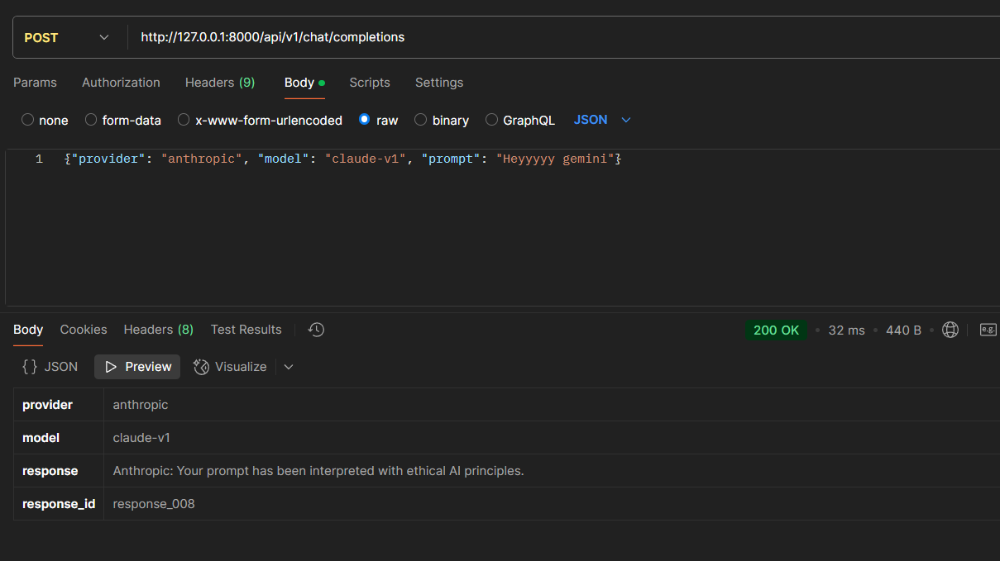
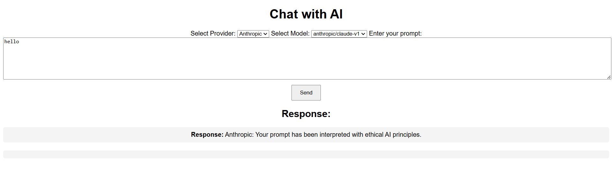

# Unbound Security Hackathon 2025
 
Milestone 1: Models Endpoint

http://127.0.0.1:8000/api/models/

feat: Implemented models endpoint to fetch supported models from DB

Milestone 2: Chat Completions Endpoint
http://127.0.0.1:8000/api/v1/chat/completions

feat: Added chat completions endpoint with provider and model validation

Milestone 3: Regex-Based Routing Policy

feat: Implemented regex-based routing for prompt redirection

Milestone 4: Simple Chat UI

feat: Developed basic chat UI with model selection and prompt input

Milestone 5: Admin Portal

feat: admin portal for managing regex rules and routing

Milestone 6: File Upload Support in Chat Portal

feat: file uploads

Milestone 7: Special Routing for File Uploads

feat: Implemented special routing policy for file uploads

